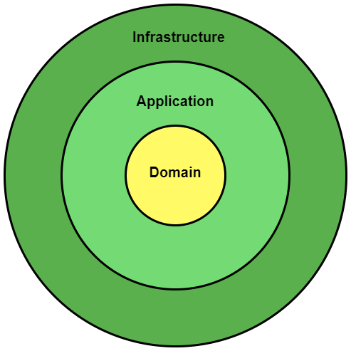

# clean-arch-ddd

Illustrate Clean Architecture and Domain Driven Design through TypeScript implementation. Can be used as starter
template for backend application. The design is inspired from the book “Implementing Domain Driven Design by Vaughn
Vernon” and “Clean
Architecture by Robert Martin”. It’s recommend to first read those books before you start using this template.

## Highlights

- **Clean Architecture**: horizontal slicing into different layers of abstraction. Namely, Domain Layer, Application
  Layer,
  Infrastructure Layer.
- **Tactical Domain Driven Design**: vertical slicing into different Bounded Contexts. Each Bounded Context has its own
  Domain Model, Repository, Service, Usecase, Controller.
- **CQRS**: Command Query Responsibility Segregation in the codebase (`src/command` and `src/query`). Enable different
  code logic for read and write. ([reference](https://enterprisecraftsmanship.com/posts/types-of-cqrs/))
- **Dependency Injection**: Use [trsyringe](https://www.npmjs.com/package/tsyringe) for IOC container. Each Bounded
  Context has its
  own container and allows Infrastructure Layer implementation to be swapped out easily.
- **Eventual Consistency**: Use Eventbus and Domain Event to maintain consistency between Aggregates in different
- **Result Monad**: Use [Result Monad](src/core/Result.ts) to enforce explicit error handling and to handle error in a
  functional style. This also allow propagating HTTP errors to client in a nicer way (
  See [this](src/common/CommonError.ts) in project).
  Bounded Contexts.
- Combine [Objection.js](https://www.npmjs.com/package/objection) ORM with Repository Pattern for storage logic.
- Support HTTP with [Express.js](https://www.npmjs.com/package/express).
- Support WebSocket with Node.js [websocket](https://www.npmjs.com/package/websocket).
- Structure logging with  [winston](https://www.npmjs.com/package/winston).

## Prerequisites

First, ensure that you are using a machine meeting the following requirements:

- Have `docker` and `docker-compose` installed.
- If you want to run locally, you need to have `node` 20.11 and `npm` installed.
- Have a keyboard for you to type command.
- Chill enough.

## Basic Configuration

The project configuration are from environment variable. It uses the [dotenv](https://www.npmjs.com/package/dotenv)
package to manage environment variables.
This package looks for a file named `.env` in the root of the project and loads the environment variables from it.
This file is not committed to the repository and is used to store sensitive information such as API keys and secrets.
You can find a sample of the `.env` file in the `.env.example` file.

## Running the build in Docker

Run `docker-compose build` and `docker-compose up -d` to run the tool.
Docker will read environment variables from the `.env` file and use them to configure the application.

## Running the build locally

All the different build steps are orchestrated via [npm scripts](https://docs.npmjs.com/misc/scripts).
Npm scripts basically allow us to call (and chain) terminal commands via npm.
This is nice because most JavaScript tools have easy to use command line utilities allowing us to not need grunt or gulp
to manage our builds.
If you open `package.json`, you will see a `scripts` section with all the different scripts you can call.
To call a script, simply run `npm run <script-name>` from the command line.
You'll notice that npm scripts can call each other which makes it easy to compose complex builds out of simple
individual build scripts.
Below is a list of all the scripts this template has available:
| Npm Script | Description |
| ------------------------- | ------------------------------------------------------------------------------------------------- |
| `lint` | Runs Prettier & ESLint on project files (inside `src/` folder). Make sure run this before submitting your
code for merge
request. |
| `build` | Compiles all source `.ts` files to `.js` files in the `build` folder |
| `test` | Runs tests. |
| `dev` | Runs the build app in development mode. Useful for local development. |

Run the build using `npm run build` and `npm run start`.

## Project Structure

| Name               | Description                                                                                  |
|--------------------|----------------------------------------------------------------------------------------------|
| **build**          | Contains the distributable (or output) from your TypeScript build. This is the code you ship |
| **node_modules**   | Contains all your npm dependencies                                                           |
| **src**            | Contains your source code that will be compiled to the build dir                             |
| **src/App.ts**     | Entry point to your express app                                                              |
| .gitlab-ci.yml     | Used to configure Gitlab CI/CD build                                                         |
| .gitignore         | File to exclude from git version control                                                     |
| package.json       | File that contains npm dependencies as                                                       |
| tsconfig.json      | Config settings for compiling server code written in TypeScript                              |
| .eslint.config.mjs | Config settings for ESLint code style checking                                               |

## Architecture

To be able to understand the architecture, you need to understand ddd concepts first.
This article will give you a brief overview of the concepts and most implementation in this project is based on these:

[An Introduction to Domain-Driven Design (DDD) | Khalil Stemmler](https://khalilstemmler.com/articles/domain-driven-design-intro/)

### Bounded Context (Vertical Slicing)

DDD divides up a large system into Bounded Contexts, each of which can have a unified model. A Bounded Context is an
explicit boundary within which domain models exist. The domain model expresses a Ubiquitous Language as a software
model. The boundary is created because each of the concepts, properties and operations inside has a special meaning.
Bounded Contexts have both unrelated concepts (such as a support ticket only existing in a customer support context) but
also share concepts (such as products and customers). Different contexts may have completely different models of common
concepts with mechanisms to map between these polysemic concepts for integration. Read more about Bounded Context:

- [bliki: Bounded Context](https://martinfowler.com/bliki/BoundedContext.html)
- [Domain analysis for microservices - Azure Architecture Center](https://learn.microsoft.com/en-us/azure/architecture/microservices/model/domain-analysis)

### Layer (Horizontal Slicing)

Read [Clean Coder Blog](https://blog.cleancoder.com/uncle-bob/2012/08/13/the-clean-architecture.html).

### Component in a Bounded Context

#### Entity

An entity is an object with a unique identity that persists over time. It’s a thing in a Bounded Context. Entities
should be the first place that we think of to put domain logic. It maintain invariants in itself and expose function for
others to change itself. Can be found or distinguished by its identity.

- Has unique identity. An entity has a unique identifier in the system, which can be used to look up or retrieve the
  entity. That doesn't mean the identifier is always exposed directly to users. It could be a GUID or a primary key in a
  database.
- Mutable (but cannot change its identity). The attributes of an entity may change over time. For example, a person's
  name or address might change, but they are still the same person.
- An identity may span multiple bounded contexts, and may endure beyond the lifetime of the application. For example,
  bank account numbers or government-issued IDs are not tied to the lifetime of a particular application.
- An entity can hold references to other entities.

Reference

- Ch5 of Implementing Domain Driven Design by Vaughn Vernon.
- [Understanding Domain Entities [with Examples] - DDD w/ TypeScript | Khalil Stemmler](https://khalilstemmler.com/articles/typescript-domain-driven-design/entities/)

#### Value Object

It measures, quantify or describe things in a Bounded Context. It’s not a thing. A value object has no identity. It is
defined only by the values of its attributes.

- Immutable after its creation. To update a value object, you always create a new instance to replace the old one.
- Value objects can have methods that encapsulate domain logic, but those methods should have no side-effects on the
  object's state. Only has Side-Effect-Free function for others to use (Immutable).
- Conceptual Whole. All attributes in a Value Object together describe that Value Object. If taken out some attributes,
  they cannot describe anything.
- Completely replaceable. If you want to modify a value object, just create a new one and replace the old one.
- Compare with others using Value Equality. If type same and value same, then two Value Objects are same.
- Enum should be considered as Value Object.
- Typical examples of value objects include colors, dates and times, and currency values.

Reference

- Ch6 of Implementing Domain Driven Design by Vaughn Vernon.
- [Value Objects - DDD w/ TypeScript | Khalil Stemmler](https://khalilstemmler.com/articles/typescript-value-object/)

#### Domain Event

Domain events can be used to capture an occurrence of something that happened in the Bounded Context. Also useful for
Eventual Consistency.

- Immutable after its creation.
- Only has Side-Effect-Free function for others to use (Immutable).
- Generally used to facilitate Eventual Consistency.
- Eliminate the need for two-phase commit (global transactions).
- Help Aggregate maintain their rule (A single TX can only modify a single Aggregate). You can modify other Aggregate by
  publishing Domain Event and make subscribers modify other Aggregate.
- Can be consumed by local Bounded Context or foreign Bounded Context.
- Can have unique identity. Useful if you want subscribers to detect whether they receive duplicate events.
- If event is synchronous (subscriber execute immediately), be careful not to break Aggregate rule. Only change an
  Aggregate in a single Transaction.

Reference

- Ch8 of Implementing Domain Driven Design by Vaughn Vernon
- [Where Do Domain Events Get Created? | Domain Driven Design w/ TypeScript | Khalil Stemmler](https://khalilstemmler.com/blogs/domain-driven-design/where-do-domain-events-get-dispatched/)
- [Decoupling Logic with Domain Events [Guide] - Domain-Driven Design w/ TypeScript | Khalil Stemmler](https://khalilstemmler.com/articles/typescript-domain-driven-design/chain-business-logic-domain-events/)

#### Aggregate

An aggregate defines a consistency boundary around one or more entities. A Consistency Boundary logically asserts that
everything inside adheres to a specific set of business invariant rules. No matter what operation we use on the
Aggregate, it’s always consistent. The consistency of everything outside this boundary is irrelevant to the Aggregate.

Exactly one entity in an aggregate is the root. Lookup is done using the root entity's identifier. Any other entities in
the aggregate are children of the root, and are referenced by following pointers from the root.

- The purpose of an aggregate is to model the true invariants in Consistency Boundary.
    - Must understand Aggregate’s True Invariant. Otherwise, we will have a wrong Consistency Boundary. That will give
      us a large Aggregate.
- Maintain invariant with Transactional Consistency not Eventual Consistency. Use Eventual Consistency outside the
  boundary.
    - Aggregate represents an unit of data change. Modify only one Aggregate instance in a single transaction.
    - 1 Transaction ↔︎ 1 Aggregate ↔︎ 1 Repository
- Try to design small Aggregate.
    - Scale and perform better.
    - Ask yourself, do you really have to maintain Transactional Consistency among each data? Can we use Eventual
      Consistency?
- Usually has a Factory method to ensure that Aggregate is created correctly.
- Avoid Dependency Injection of a Repository or Domain Service into an Aggregate. (Explained below)

Reference

- Ch10 of Implementing Domain Driven Design by Vaughn Vernon
- [How to Design & Persist Aggregates - Domain-Driven Design w/ TypeScript | Khalil Stemmler](https://khalilstemmler.com/articles/typescript-domain-driven-design/aggregate-design-persistence/)
- [How to Handle Updates on Aggregates - Domain-Driven Design w/ TypeScript | Khalil Stemmler](https://khalilstemmler.com/articles/typescript-domain-driven-design/updating-aggregates-in-domain-driven-design/)
- [Handling Collections in Aggregates (0-to-Many, Many-to-Many) - Domain-Driven Design w/ TypeScript | Khalil Stemmler](https://khalilstemmler.com/articles/typescript-domain-driven-design/one-to-many-performance/)
- [Challenges in Aggregate Design #1 - Domain-Driven Design w/ TypeScript | Khalil Stemmler](https://khalilstemmler.com/articles/typescript-domain-driven-design/domain-modeling-1/)

#### Repository

It’s usually considered a place to store things. When you store something in a repository and later take it out, you
expect that it will be in the same state as it was. At some point, you may choose to remove that thing from the
repository.

- Provide only for Aggregate. Every Aggregate will have a Repository.
    - It’s an 1:1 relationship.
    - 1 Transaction ↔︎ 1 Aggregate ↔︎ 1 Repository
- Repository will be an interface inside Domain Layer and implemented inside Infrastructure Layer.
- Usually you will need Mapper and DTO when converting data format between Aggregate and Persistent Store(Database).
- Try to design Repository with a collection orientation instead of a data access orientation. Make your client feels
  like they’re using a collection not a database.
- Do not provide function that query parts of an Aggregate. Always retrieve whole Aggregate. (Unless you face a
  unacceptable bottleneck)
- Ensure that Usecase can use transaction on a Repository.

Reference

- Ch12 of Implementing Domain Driven Design by Vaughn Vernon
- [How to Design & Persist Aggregates - Domain-Driven Design w/ TypeScript | Khalil Stemmler](https://khalilstemmler.com/articles/typescript-domain-driven-design/aggregate-design-persistence/)
- [Implementing DTOs, Mappers & the Repository Pattern using the Sequelize ORM [with Examples] - DDD w/ TypeScript | Khalil Stemmler](https://khalilstemmler.com/articles/typescript-domain-driven-design/repository-dto-mapper/)

#### Domain Service

A stateless operation that fulfills a domain specific task. When you’re not sure an operation should be put into an
Aggregate, Entity or Value Object, you probably need to put it into a Domain Service.

- Stateless.
- Can use Repository.
- Can subscribe to Domain Event.
- Can be an interface and implements by a concrete class in Infrastructure Layer (Separated Interface).
- Common task
    - Perform a significant business logic.
    - Transform a domain object from one composition to another.
    - Calculate a Value requiring input from more than one domain object.
    - Access data from other bounded context. (Domain Service acts as a Factory and must be interface in this case)
- Should be as thin as possible, otherwise will cause Anemic Domain Model.

Reference

- Ch12 of Implementing Domain Driven Design by Vaughn Vernon

#### Usecase (a.k.a. Application Service)

Responsible for task coordination of use case flows.

- One service per use case flow.
- Control Transaction.
    - 1 usecase can run multiple transactions, but each transaction can only modify 1 aggregate.
    - 1 Transaction ↔︎ 1 Aggregate ↔︎ 1 Repository
- Control Security.
- Direct client of Domain Layer stuff (Can use Aggregate, Repository, Domain Service…).
- Usually receives and returns DTO to client (User Interface). Shield the client from knowing Domain Layer.
- Should be as thin as possible, otherwise will cause Anemic Domain Model. Try to push all business logic into Domain
  Layer.

Reference

- [Better Software Design with Application Layer Use Cases | Enterprise Node.js + TypeScript | Khalil Stemmler](https://khalilstemmler.com/articles/enterprise-typescript-nodejs/application-layer-use-cases/)

#### Subscriber (Specialized Usecase)

It’s a Usecase but specialized to subscribing Domain Event. All rules are same as Usecase.

#### Infrastructure

All dirty stuff.

- Router
- Dispatcher (API version control)
- API Authentication
- Implementation for Repository interface.
- Implementation for Domain Service interface.

### Important Notes

#### What’s the difference between Entity and Value Object? Which is preferred?

Strive to use Value Object instead of Entity wherever possible. Value Object is easier to create, test, use, optimize
and maintain.

#### How to persist Value Object?

We always design our data model for the sake of our domain model, not the other way around. Usually, a Value Object
lives in an Entity and it will be persist along with that Entity. Entity can be persist in to a row in SQL database. In
this case, Value Object can be persist into a column on that row. Easy.
For a collection of Value Object in an Entity, you can do:

- Serialize that collection into a textual representation and put it into a single column
    - Not a good idea
    - Column width in DB is no joke
    - Value Object is not queryable
- Give each Value Object a single row
    - Better
    - When retrieve that Entity, must read all associated Value Objects out

#### What if a single client request need to modify multiple Aggregates instead of one Aggregate?

Use Eventual Consistency. One way to do this is using Domain Event. An Aggregate publish a Domain Event after it is
modified. Each of the subscribers executes in a separate transaction, obeying the rule of Aggregates to modify just one
instance per transaction. If the subscriber does not execute successfully, we try sending event to that subscriber until
it execute successfully or a retry limit is reached. If still fails, there will be at least some error logs.

#### How can an Aggregate reference another Aggregate in the same bounded context?

There are 3 ways

1. An Aggregate A holds references to the Root of other Aggregate B.

- Note that this does not place Aggregate B into the Consistent Boundary of Aggregate A.
- This approach could cause memory consumption, when you get Aggregate A from repository. You’ll have to read Aggregate
  B into memory when getting A.

2. Dependency Injection of a Repository or Domain Service into an Aggregate.

- Not perfect.
- Has some overhead and makes Aggregate more complex.

3. An Aggregate A holds the unique identity of other Aggregate B.

- Way better.
- You can use a Repository or Domain Service to look up dependent objects ahead of invoking the Aggregate behavior.

#### How can an Aggregate get data from a different bounded context?

Write a Domain Service and implement it in Infrastructure Layer.

#### What if an Aggregate grows out of scope and hurt DB performance?

Dude, that probably means your Aggregate is too large!

#### When updating an Aggregate, do we have to load all data from DB?

No.

#### What if we want to query some portion of an Aggregate or multiple Aggregates in a query request?

- CQRS
- Use Case Optimal Query

#### Can an Usecase execute more than 1 transaction?

- Yes, but make sure 1 transaction only modify 1 aggregate.
- Initially, we didn’t allow this, so Usecase can only have 1 transaction. However, later on we found it’s too
  troublesome for development. We would need to use domain event to separate Usecase logic. That created ugly code and
  was also hard to read.
